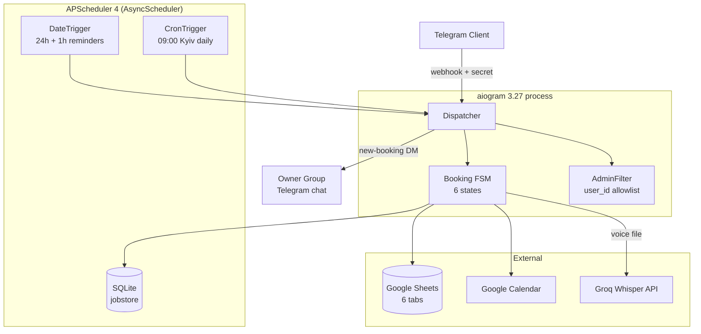

# Booking Bot

> Telegram bot that replaces the booking-manager role for SMB salons, barbershops, and studios. Ten taps from "/start" to a confirmed appointment with calendar event, reminders, and owner notification.


## Live demo


*30-second sequence: `/start` → 📅 Записаться → service pick → master pick → date pick → slot pick → 🎤 voice name input → "Распознано: …" confirm → phone share → final confirm → success message. Captured locally against a private demo bot.*

## Architecture



Full architectural rationale: [`docs/architecture.md`](docs/architecture.md).

## The three WOW features

| # | Feature | One-liner | Screenshot |
|---|---|---|---|
| 1 | **Google Calendar two-way sync** | When a master manually blocks time in their personal Calendar, those slots disappear from the bot's pickers within 60 seconds — no extra config needed. | `docs/screenshots/wow1-calendar-sync.png` |
| 2 | **Automatic VIP status** | Daily cron at 09:00 Kyiv detects clients with ≥5 completed visits + an upcoming booking and sends them a one-time promo DM. Idempotent via a `_vip_sent` sheet. | `docs/screenshots/wow2-vip-dm.png` |
| 3 | **Voice name input (Groq Whisper)** | Inline "🎤 Голосом" button on the name prompt → speak your name → bot transcribes via `whisper-large-v3-turbo` and asks to confirm. Free-tier: $0. Graceful text fallback on any failure. | `docs/screenshots/wow3-voice.png` |

## Stack

- **Language:** Python 3.11
- **Bot framework:** aiogram 3.27
- **Scheduler:** APScheduler 4.0 (`AsyncScheduler` + `SQLAlchemyDataStore` + Pickle serializer on aiosqlite)
- **Storage:** Google Sheets via gspread v6 (sync calls wrapped with `asyncio.to_thread`)
- **Calendar:** google-api-python-client (Calendar v3)
- **AI:** Groq SDK `AsyncGroq` with Whisper-Large-v3-turbo (free tier)
- **Config:** pydantic-settings v2 with `SecretStr`
- **Web:** aiohttp (webhook receiver in production)
- **Deploy:** Railway with Dockerfile + persistent volume for the SQLite jobstore

## Project structure

```
booking-bot/
├── bot/
│   ├── main.py              # entry: bot, dispatcher, scheduler lifecycle, aiohttp app
│   ├── config.py            # pydantic-settings BaseSettings
│   ├── states.py            # FSM StatesGroup definitions
│   ├── callbacks.py         # CallbackData factory classes
│   ├── models.py            # Pydantic v2 domain models (Service, Master, Booking, ...)
│   ├── handlers/
│   │   ├── start.py         # /start, main menu
│   │   ├── booking.py       # booking FSM (service → master → date → slot → contact → confirm)
│   │   ├── my_bookings.py   # view + cancel
│   │   ├── admin.py         # /today /week /stats /export
│   │   ├── errors.py        # global error handler
│   │   ├── reminders.py     # APScheduler-fired send_reminder (module scope, write-after-success)
│   │   └── vip.py           # daily VIP sweep + pure helper select_vip_candidates
│   ├── keyboards/
│   │   ├── inline.py        # service/master/date/slot/confirm builders
│   │   └── reply.py         # main menu, share-contact
│   └── services/
│       ├── sheets.py        # gspread wrapper, all calls via to_thread
│       ├── calendar.py      # Google Calendar wrapper + 60s freebusy cache
│       ├── scheduler.py     # AsyncScheduler with SQLAlchemyDataStore + Pickle
│       ├── whisper.py       # AsyncGroq audio.transcriptions.create wrapper
│       ├── slots.py         # pure slot availability calculator
│       └── phone.py         # UA phone normalization to +380XXXXXXXXX
├── tests/                   # 77 tests covering pure functions + FSM transitions + idempotency
├── docs/
│   └── architecture.md      # this design's "why" deep dive
├── data/                    # mounted persistent volume on Railway (SQLite jobstore)
├── Dockerfile
├── railway.toml
├── pyproject.toml
├── CLAUDE.md                # Claude Code operator instructions for this project
├── project_specs.md         # full technical spec (FSM, data model, integration rules, gates)
└── learnings.md             # running gotchas + reusable patterns log
```

## Case narrative

**Problem.** Small-business owners (one to five-person teams) lose 2–5 hours/week on appointment scheduling: DMs at 11 PM, "what time was I free again?", forgotten cancellations, ghosting. Hiring a booking manager is overkill; a web form misses the "open on the phone you already have" reality. They live inside Telegram already.

**Key architectural decisions.**
- **Sheets-as-CRM** instead of building admin UI — owner already knows Sheets, zero monthly cost, audit trail in `_errors` tab. ([`docs/architecture.md#why-sheets-as-crm`](docs/architecture.md#why-sheets-as-crm))
- **APScheduler 4 with persistent SQLite jobstore** instead of v3 — restart-safe reminders, async-native lifecycle. The brief mentioned v3; Context7 surfaced the rewrite. ([`docs/architecture.md#why-apscheduler-4`](docs/architecture.md#why-apscheduler-4-despite-the-brief-specifying-v3))
- **Service-account Calendar sharing** instead of OAuth per master — one credential file does Sheets + Calendar, no token refresh. ([`docs/architecture.md#why-service-account-calendar-sharing`](docs/architecture.md#why-service-account-calendar-sharing-not-oauth-per-master))
- **Write-after-success idempotency** for every side effect (reminder DMs, VIP DMs, cancellations) — flag flips only AFTER the external call succeeds. Restart mid-flow is always safe to retry. ([`docs/architecture.md#idempotency-strategy`](docs/architecture.md#idempotency-strategy--three-guards))
- **AI as enhancement layer, not critical path** — voice transcription is a UX nicety. Groq down? Text input still works. ([`docs/architecture.md#ai-as-enhancement-layer`](docs/architecture.md#ai-as-enhancement-layer))

**Result.** From `/start` to confirmed booking in 10 taps. Owner gets a notification within 2 seconds of every booking. Reminders fire at 24h and 1h before the appointment. Cancellation removes Calendar event, kills the scheduled reminders, frees the slot. Daily VIP sweep at 09:00 Kyiv. Voice input free-tier verified $0. 77 tests covering pure functions, FSM transitions, and idempotency invariants.

## Competencies demonstrated

- **Async Python.** `asyncio.to_thread` wrapping for every sync library (gspread, googleapiclient); no blocking I/O on the event loop.
- **Aiogram 3.x FSM.** Six-state booking flow with sub-step disambiguation via FSM data; `CallbackData` factory for type-safe callbacks; workflow-data DI for service singletons.
- **External API integration.** Google Sheets (gspread v6 with `get_all_records` + `batch_update`), Google Calendar v3 (events + freebusy with 60s cache), Groq Whisper (`AsyncGroq` + tuple file shape).
- **Scheduling & idempotency.** APScheduler 4 module-scope callables, Pickle serializer for cross-restart resolution, write-after-success on every side effect, three independent guard mechanisms.
- **AI integration.** Free-tier Whisper-Large-v3-turbo via Groq, graceful 2-tier failure handling (soft = stdlib log only, hard = `_errors` sheet), in-memory bytes passthrough.
- **Production hygiene.** Service-account secrets via Railway secret files, webhook secret token validation, sanitized error logging (regex-redacted), persistent volume for scheduler state.

## Running locally (for the owner)

```powershell
# 1. Clone, create venv, install deps
git clone <repo-url>
cd booking-bot
py -3.11 -m venv .venv
.\.venv\Scripts\pip install -e .

# 2. Copy .env.example to .env and fill values
#    (see project_specs.md §3.1 for the full var list)

# 3. Put service-account JSON at ./secrets/credentials.json
#    Share the spreadsheet AND each master's calendar with that email.

# 4. Run in polling mode
$env:MODE="polling"; python -m bot.main
```

Production deploy: Railway (Dockerfile + persistent volume for `/app/data`). Full deploy recipe in [`project_specs.md` §5.3](project_specs.md).

## License

This is a portfolio project. Reach out before adapting commercially.
