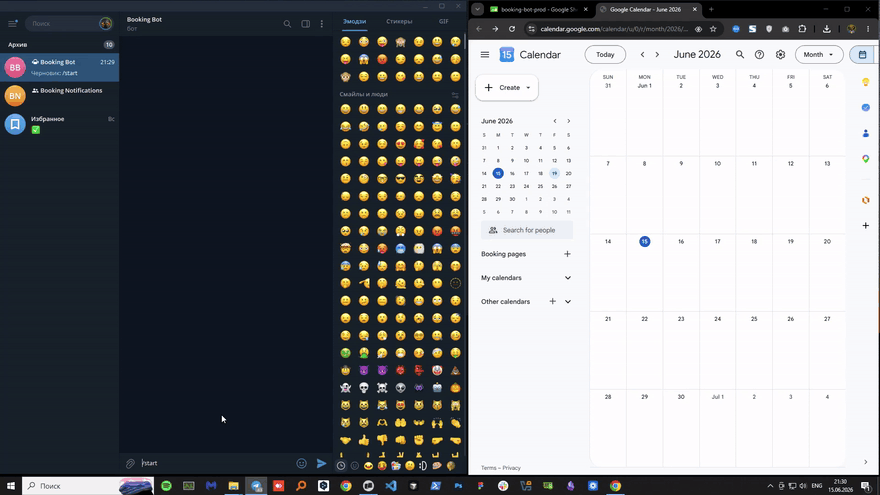

# Booking Bot
> A Telegram bot that replaces the booking-manager role for small salons, barbershops, and studios. Ten taps from `/start` to a confirmed appointment with calendar event, owner notification, and reminders.

## Overview

Small business owners (one to five-person teams) lose two to five hours a week on appointment scheduling: DMs at 11 PM, "what time was I free again?", forgotten cancellations, ghosting. Hiring a booking manager is overkill and a web form misses the "open on the phone you already have" reality. They already live inside Telegram. This bot turns that into a real booking system in under a minute per appointment: client picks a service, master, date, and slot; bot writes the booking to a shared Google Sheet, creates a Calendar event for the master, schedules 24-hour and 1-hour reminders that survive restarts, and notifies the owner's chat.

## Key Features

- **Ten-tap booking flow** — `/start` → service → master → date → free slot → voice or text name → contact share → confirm → done. Six-state FSM keeps the conversation reliable across timeouts and out-of-order replies.
- **Two-way Google Calendar sync.** When a master manually blocks time in their personal Calendar ("Lunch 12–13"), those slots disappear from the bot's pickers within ~60 seconds. No webhook plumbing — a freebusy query with a one-minute in-memory cache.
- **Voice name input via Groq Whisper Large v3 Turbo.** Inline "🎤 By voice" button on the name prompt → user speaks → bot transcribes for free and asks for a confirmation. Text fallback whenever Groq is down or the key is rejected.
- **Automatic VIP detection.** A daily cron at 09:00 Kyiv finds clients with ≥5 completed visits and at least one upcoming booking, and sends a one-time promo DM. Idempotent via a separate `_vip_sent` sheet so the same person never gets the message twice.
- **Sheets-as-CRM.** The owner edits bookings in a Google Sheet they already know. No admin UI to learn or maintain.
- **Reminders that survive restarts.** APScheduler 4 with a persistent SQLite jobstore + Pickle serializer for the actual function references — every scheduled reminder is still there after a redeploy.

## Tech Stack

**Language + bot framework**
- Python 3.11
- aiogram 3.27 (Dispatcher, FSM, CallbackData factories, workflow-data DI)

**Scheduling**
- APScheduler 4.0 — `AsyncScheduler` + `SQLAlchemyDataStore` over `aiosqlite` + Pickle serializer

**Storage + integrations**
- Google Sheets via `gspread` v6 (sync calls wrapped with `asyncio.to_thread`)
- Google Calendar v3 via `google-api-python-client`
- Groq SDK `AsyncGroq` — Whisper Large v3 Turbo, free tier

**Web + runtime**
- `aiohttp` webhook receiver in production, long-polling in dev
- `pydantic-settings` v2 with `SecretStr` for config

**Deploy**
- Railway: Dockerfile + persistent volume for the SQLite jobstore + secret files for the service-account JSON

## Architecture Highlights

**1. Write-after-success idempotency on every side effect.** Reminder DMs, VIP promo DMs, and the five-step cancellation flow all follow the same pattern: do the external call first, then flip the guard flag in Sheets only on success. A process that dies mid-flow is always safe to retry, because no "done" flag exists before the work actually completed. Three independent guards (`reminder_24h_sent`, `reminder_1h_sent`, `_vip_sent` tab) catch the three places where a duplicate would be visible to the user.

**2. APScheduler 4 — not v3 — with persistent jobstore.** v3 is end-of-life and isn't async-native; v4's `AsyncScheduler` is. The jobstore lives on a Railway persistent volume so scheduled reminders survive every redeploy, including the ones triggered by code changes. The Pickle serializer is what makes that work — it persists the actual callable's import path, so after a restart the resolver re-binds to `bot.handlers.reminders.send_reminder` and fires the job exactly as scheduled.

**3. Service-account Calendar sharing instead of OAuth per master.** One credentials file does both Sheets and Calendar; the owner adds the service-account email to each master's Calendar with "Make changes to events" permission. No per-user OAuth dance, no token refresh code path, no expired-grant failures. The trade-off is each master must remember to share their calendar once — documented in onboarding.

**4. Two-way Calendar sync without webhooks.** Google Calendar push notifications are HTTPS-only and add a renewal-channel-every-7-days operational burden. Pull-based freebusy with a 60-second per-master in-memory cache gives the same UX (a manually-added block disappears from the next slot pick) for zero infrastructure. Cache TTL is short enough that the "blocked something five seconds ago" story still works; long enough that a busy hour doesn't bombard the Calendar API.

**5. AI as enhancement, not critical path.** Voice input is a UX nicety: Groq down, key revoked, or transcription times out → bot quietly falls back to text input and logs the failure to a `_errors` sheet. The booking flow never depends on the AI call succeeding.

## Status

Case study / portfolio project. 77 tests covering pure logic (slot availability, phone normalization, VIP candidate selection), FSM transitions, and the idempotency invariants. Type-checked with mypy strict; lint clean with ruff.
