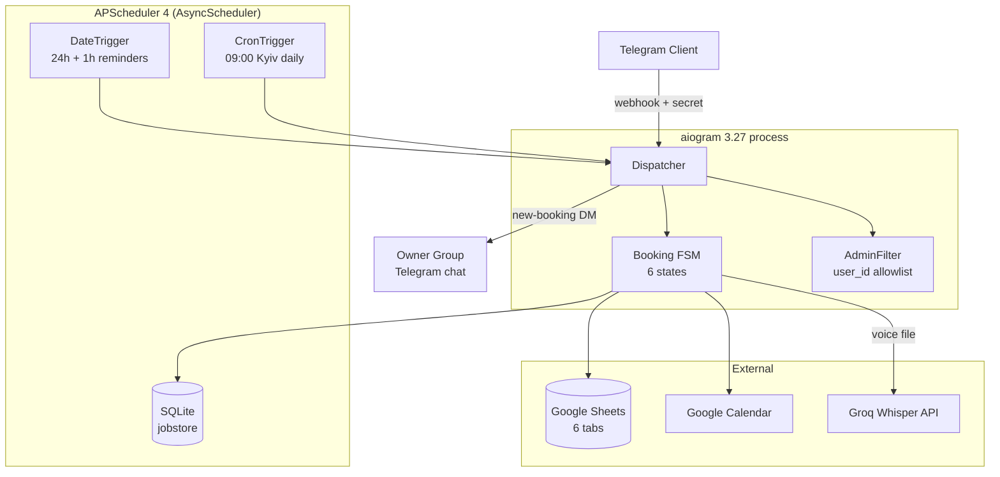

# Booking Bot — Architecture

This is a portfolio-grade overview of the load-bearing architectural decisions. For the full specification (data model, FSM transitions, integration rules, quality gates) see [`project_specs.md`](../project_specs.md).

## System diagram

## Why a Telegram bot

Salons, barbershops, and small studios in Eastern Europe live inside Telegram already — clients message the owner there now, manually. A bot replaces the human "booking manager" without forcing clients onto a new platform. WhatsApp has higher friction (Business API costs and verification), and a web form fails the "open on the phone you already have" test the moment a regular wants to rebook.

## Why Sheets-as-CRM

The owner already knows Google Sheets. There's no admin UI to build, no database to operate, and zero monthly cost — the bot writes rows, the owner edits cells. A `_errors` tab and a `_vip_sent` tab live alongside business data so the owner can audit failures and VIP eligibility without a separate dashboard. The trade-off is gspread rate limits (~60 reads/min/user) — managed via 60-second freebusy cache and `batch_update` for multi-cell writes.

## Why APScheduler 4 (despite the brief specifying v3)

The brief mentioned APScheduler with v3-shape calls. Context7 against `/agronholm/apscheduler` showed v3 is no longer the maintained version: v4's API is a full rewrite (`AsyncScheduler` instead of `AsyncIOScheduler`, `add_schedule` instead of `add_job`, `SQLAlchemyDataStore` instead of `SQLAlchemyJobStore`, CBOR/Pickle serializers). v4 also restored async-native lifecycle — which the bot needs because aiogram is async. The library was the moving piece, not the spec. Verified before writing code; spec section §9.3 captures the rewrite.

## Why service-account calendar sharing (not OAuth per master)

The brief implied full OAuth per master: consent screen, redirect handler, refresh-token storage, ~200 LOC of compliance code. We replaced it with a one-time manual share: each master gives the service-account email "Make changes to events" permission on their personal Calendar. Same auth shape as Sheets — one credential file does both APIs. The compliance surface is smaller, the user-side onboarding is one click instead of an OAuth dance, and there are no expiring tokens to refresh.

## Idempotency strategy — three guards

1. **Reminder flags** (`reminder_24_sent`, `reminder_1_sent` columns). Write-after-success: send DM first, only flip the flag on Telegram 200. A duplicate fire (restart mid-send) skips because the flag is set; a failed fire stays unset so the next attempt retries.
2. **`_vip_sent` sheet**. Client-scoped guard (not booking-scoped) for the daily VIP sweep. One row per lifetime VIP — checked at every daily run.
3. **Cancellation status flip ordering**. Calendar event delete → APScheduler `remove_schedule` → Sheets status flip. If the process dies between steps, the row stays `confirmed` so the next attempt can re-run idempotently (Calendar `delete` is no-op on already-deleted events; `remove_schedule` is no-op on missing IDs). Sheet flip is the LAST step, so partial completion is always safe to retry.

## AI as enhancement layer

Whisper voice transcription (WOW 3) is a UX nicety, not a hard dependency. If Groq's API is down or `GROQ_API_KEY` is invalid, the voice handler logs a hard failure to `_errors`, shows the user "Не удалось распознать голос. Введите имя текстом.", and stays in the same FSM state. Text and "Поделиться контактом" remain fully functional. The bot's core booking flow has zero AI in the critical path.

## Error handling chain

Every handler either succeeds, fails to the user with a clear message, or escalates to `bot/handlers/errors.py:global_error_handler`. The handler logs the traceback via stdlib, writes a sanitized row to `_errors` (regex redacts any field name matching `token|key|password|secret|credential`), and best-effort DMs the owner. User-flow events (incomplete phone, blocked-by-bot, empty Whisper transcription) NEVER reach this chain — they're handled in-state with friendly messages per `learnings.md` "Don't throw on partial user-side data".

## Git as the disaster-recovery mechanism

This project's code is the single source of truth. There's no n8n JSON to back up, no Make.com blueprint to export. To restore from total loss: `git clone`, set env vars, redeploy on Railway. The Sheets data is already cloud-hosted; the scheduler state lives on a Railway persistent volume that survives redeploy; secrets are in Railway's secret store. The git repo IS the runbook.
